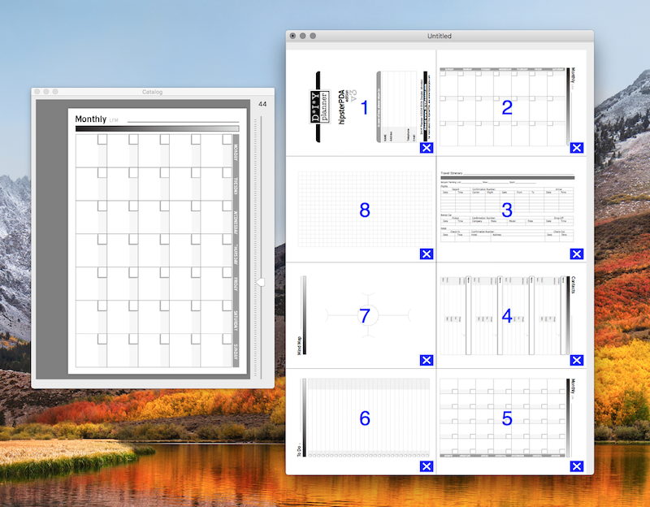
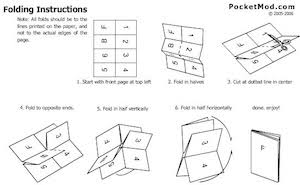

# PagePacker

PagePacker was an application written in the early 2000s that let you build little pocket sized notebooks. It was put out by _Big Nerd Ranch_ and written by _Aaron Hillegass_.

I had found the application quite useful, for on-the-go-notes and making little pocket zines. 

Here is what the application looks like:

Folding instructions:

Here is a very old YouTube video of me making some notes using PagePacker: [YouTube](https://www.youtube.com/watch?v=4JFsvGsm95w)

## Is this the original?

When I went looking for the application recently, it seems it had fallen into the void of the internet.

Luckily, Aaron open sourced the application back in 2007:

> Aaron Hillegass	
> November 5, 2007 | Mac	
> I am celebrating the arrival of Mac OS X 10.5 by making the source code to PagePacker available. Here is the compiled application.

With a bit of digging around I've found the application source, and I've just put it here. 
