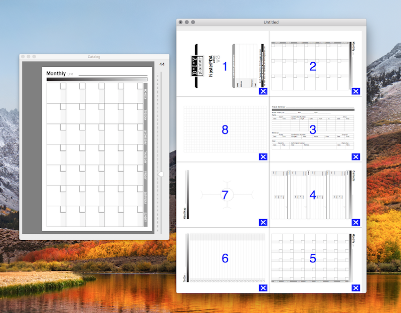
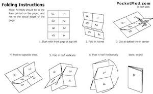

# PagePacker

PagePacker was an application written in the early 2000s that let you
build little pocket sized notebooks. It was originally created by _Big Nerd
Ranch_ and written by _Aaron Hillegass_. [Original
Post](https://web.archive.org/web/20140617173248/http://www.bignerdranch.com/blog/pagepacker-makes-pocket-sized-books/)

I found the application quite useful, for on-the-go-notes and
making little pocket zines.

Here is what the application looks like:

Folding instructions:

## Is this the original?

When I went looking for the application, it seems it had fallen into the void of the internet.

Luckily, Aaron open sourced the application back in 2007:

> Aaron Hillegass	
> November 5, 2007 | Mac	
> I am celebrating the arrival of Mac OS X 10.5 by making the source code to PagePacker available. Here is the compiled application.

With a bit of digging around I've found the original application source, and tried to updated it to the latest version of macOS (Tahoe os26 as of this writing).

## Media & Art References

This was written by Aaron Hillegass who taught Cocoa programming at Big Nerd Ranch, Inc. (a now non-existent company).

To write the app was Nate Osborne's idea. He was inspired by PocketMod. See http://www.pocketmod.com/ for details.

The original templates were released under **Creative Commons Attribution Non-Commercial No-Derivatives
license** so they have been removed from the binary release, but can be found in the [Non-Free](./Non-Free) directory if you are looking for the originals.

Matt Neuberg made PagePacker AppleScriptable.

The icon was created by Kyle Mistry: http://kylepoint.com/

The Japanese localization was done by Joshua Done.

This software and its source code are released by Big Nerd Ranch, Inc. under the BSD License.

